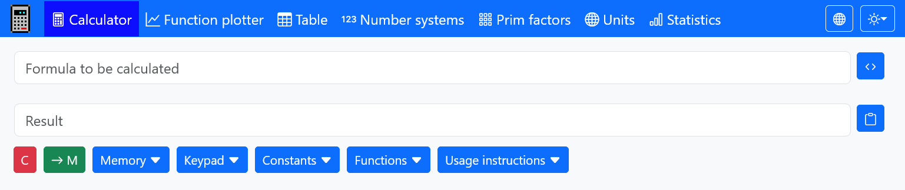
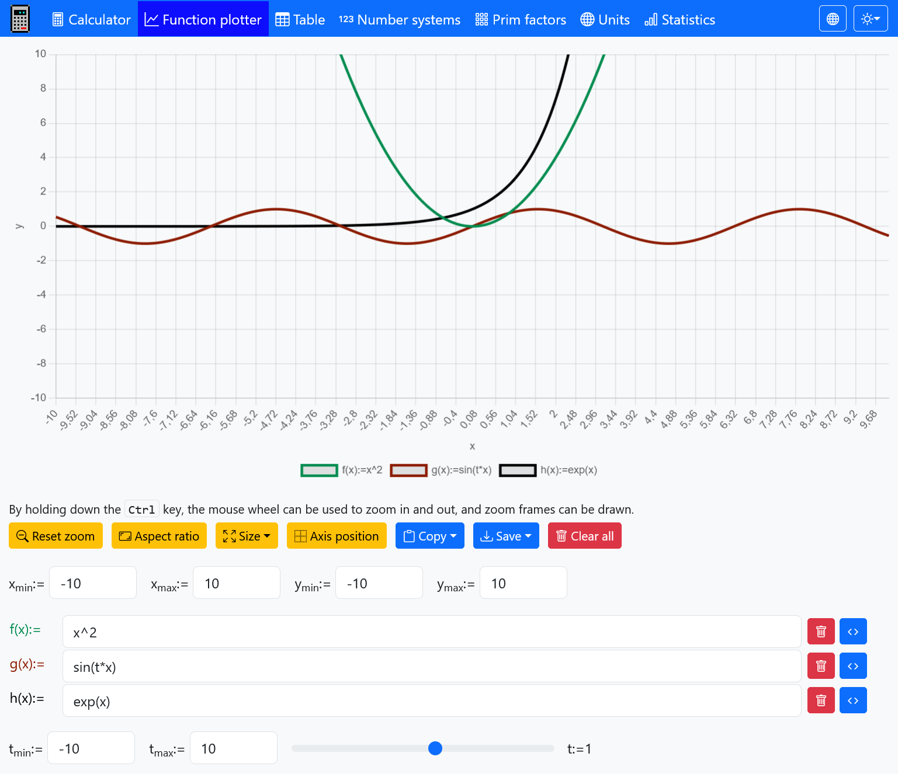
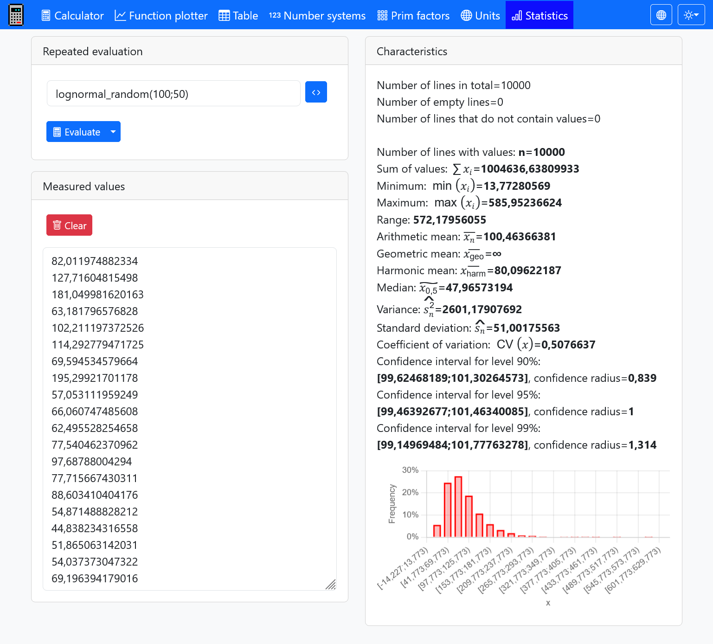
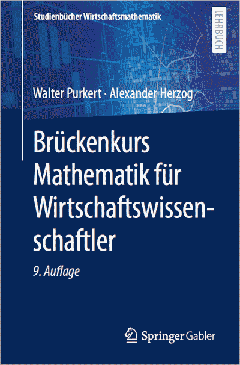

# Calculator

Calculator is a web service for different calculation tasks.

### Screenshots

Calculator page:

Function plotter page:

Statistics page:

## Usage

To use the calculator just go to

**[a-herzog.github.io/Calc](https://a-herzog.github.io/Calc/)**

You can also download the calculator as an offline usable Windows application:

- [**Calculator.exe**](https://github.com/A-Herzog/Calc/releases/latest/download/Calculator.exe) (Download & run)
- [**Calculator_Linux_MacOS.zip**](https://github.com/A-Herzog/Calc/releases/latest/download/Calculator_Linux_MacOS.zip)
- [**CalculatorSetup.exe**](https://github.com/A-Herzog/Calc/releases/latest/download/CalculatorSetup.exe) (for permanent installation - starts faster than the portable version)

## License

Calculator is licensed under the [Apache License, Version 2.0](https://www.apache.org/licenses/LICENSE-2.0).

This product bundles some components licensed under different open source licenses, see:

- [**Bootstrap**](https://getbootstrap.com/): [MIT license](https://opensource.org/license/mit/)
- [**Bootstrap icons**](https://icons.getbootstrap.com): [MIT license](https://opensource.org/license/mit/)
- [**Chart.js**](https://www.chartjs.org): [MIT license](https://opensource.org/license/mit/)
- [**chartjs-plugin-zoom**](https://www.chartjs.org/chartjs-plugin-zoom/latest/): [MIT license](https://opensource.org/license/mit/)
- [**jStat**](http://jstat.github.io/): [MIT license](https://opensource.org/license/mit/)
- [**MathJS**](https://mathjs.org/): [Apache 2.0 license](https://www.apache.org/licenses/LICENSE-2.0)

For building a desktop app from the Javascript code [**Neutralinojs**](https://neutralino.js.org/) under the
[MIT license](https://opensource.org/license/mit/) is used.

## Literature: "Brückenkurs Mathematik für Wirtschaftswissenschaftler" (in German)

[W. Purkert & A. Herzog: "Brückenkurs Mathematik für Wirtschaftswissenschaftler"](https://link.springer.com/book/10.1007/978-3-658-36742-8) 
Springer, 2022 
ISBN: 978-3-658-36741-1 
(in German)

## Contact

[Alexander Herzog](https://github.com/A-Herzog)
